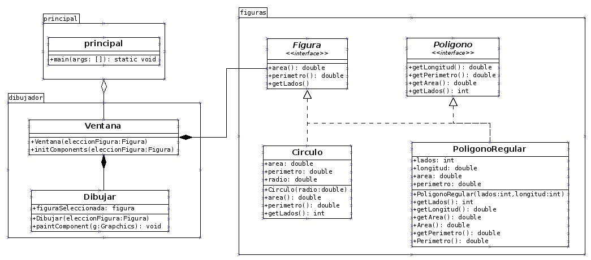

# Dibujador
 Dibujador de Figuras, Calculador de Area y Perimetro, con principios de diseño Liskov, segregación de interfaces y responsabilidad única
 
 José Quintero - 20181020061
 
 Mateo Ardila - 20181020054
 
 Johan Mendez - 20172020070

### Modelo
 
